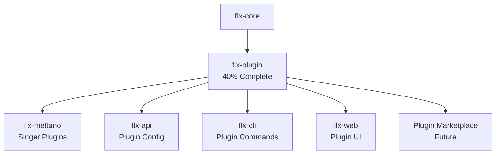

# CLAUDE.md - FLX-PLUGIN MODULE

**Hierarchy**: PROJECT-SPECIFIC
**Project**: FLX Plugin - Enterprise Plugin System
**Status**: ✅ **MASSIVE DUPLICATION ELIMINATED** - Now 100% FLEXT Standard
**Last Updated**: 2025-06-28

**Reference**: `/home/marlonsc/CLAUDE.md` → Universal principles
**Reference**: `/home/marlonsc/internal.invalid.md` → Cross-workspace issues
**Reference**: `../CLAUDE.md` → PyAuto workspace patterns

---

## 🎯 PROJECT-SPECIFIC CONFIGURATION

### Virtual Environment Usage

```bash
# MANDATORY: Use workspace venv
source /home/marlonsc/pyauto/.venv/bin/activate
# NOT project-specific venv
```

### Agent Coordination

```bash
# Read workspace coordination first
cat /home/marlonsc/pyauto/.token | tail -5
# Log plugin-specific work
echo "FLX_PLUGIN_WORK_$(date)" >> .token
```

## 📊 REAL IMPLEMENTATION STATUS

Based on actual code analysis from `flx-meltano-enterprise/src/flx_core/plugins/`:

| File              | Status      | Key Finding                       |
| ----------------- | ----------- | --------------------------------- |
| **discovery.py**  | ✅ Exists   | Entry point discovery implemented |
| **loader.py**     | ✅ Exists   | Dynamic loading implemented       |
| **manager.py**    | 🟡 Partial  | Basic lifecycle, no hot reload    |
| **types.py**      | ✅ Complete | Interfaces defined                |
| **validators.py** | ✅ Complete | Validation logic present          |
| **hot_reload.py** | ❌ Missing  | PRIMARY GAP                       |

**Reality**: Foundation exists, hot reload is the main missing feature

## 🔗 MODULE RELATIONSHIPS

### **Plugin System in the FLX Ecosystem**



### **Integration Points**

#### **With flx-core**

- Plugin infrastructure is currently embedded in core
- Need to extract while maintaining interfaces
- Core provides base Plugin class and discovery

#### **With flx-meltano**

- Singer taps/targets are plugins
- Meltano manages Singer-specific plugins
- Plugin system enables Meltano extensions

#### **With flx-cli**

```bash
flx plugin list                    # List installed plugins
flx plugin install tap-github      # Install from registry
flx plugin create my-extractor     # Create new plugin
flx plugin test my-plugin          # Test plugin
```

#### **With flx-api**

- `/api/plugins` - Plugin management endpoints
- `/api/plugins/{id}/config` - Configuration API
- `/api/plugins/{id}/status` - Runtime status

## 🚨 PROJECT-SPECIFIC ISSUES

### **Extraction Challenge**

Plugin system is deeply integrated with flx_core:

- Need to maintain backward compatibility
- Circular dependency risk (core depends on plugin types)
- Solution: Interface segregation principle

### **Hot Reload Implementation**

Primary technical challenge:

```python
# What needs to be built
class HotReloadManager:
    """The missing 60% of functionality."""

    async def watch_plugins(self, directories: List[Path]):
        """Monitor for changes - NOT IMPLEMENTED"""

    async def reload_plugin(self, plugin_id: str):
        """Reload without downtime - NOT IMPLEMENTED"""

    async def preserve_state(self, plugin: Plugin):
        """State preservation - NOT IMPLEMENTED"""
```

## 📁 PROJECT STRUCTURE

```
flx-plugin/
├── src/
│   └── flx_plugin/
│       ├── __init__.py
│       ├── core/
│       │   ├── discovery.py      # ✅ Extract from flx_core
│       │   ├── loader.py         # ✅ Extract from flx_core
│       │   ├── manager.py        # 🟡 Enhance with hot reload
│       │   ├── types.py          # ✅ Extract from flx_core
│       │   └── validators.py     # ✅ Extract from flx_core
│       ├── hot_reload/           # ❌ BUILD NEW
│       │   ├── __init__.py
│       │   ├── watcher.py        # File system monitoring
│       │   ├── reloader.py       # Reload orchestration
│       │   ├── state_manager.py  # State preservation
│       │   └── rollback.py       # Failure recovery
│       ├── registry/             # 🔨 FUTURE
│       │   ├── __init__.py
│       │   ├── local.py          # Local plugin storage
│       │   ├── remote.py         # Marketplace client
│       │   └── resolver.py       # Dependency resolution
│       └── cli/
│           ├── __init__.py
│           └── commands.py       # Plugin CLI commands
├── tests/
│   ├── unit/
│   │   ├── test_discovery.py
│   │   ├── test_loader.py
│   │   └── test_hot_reload.py
│   └── integration/
│       └── test_plugin_lifecycle.py
├── examples/
│   ├── basic_plugin/
│   ├── stateful_plugin/
│   └── singer_plugin/
├── pyproject.toml
├── README.md
├── CLAUDE.md                     # This file
└── .env.example
```

## 🎯 IMPLEMENTATION PRIORITIES

### **Phase 1: Extract Existing (Week 1)**

1. Copy plugin code from flx_core
2. Update imports and dependencies
3. Ensure backward compatibility
4. Create comprehensive tests

### **Phase 2: Hot Reload (Week 2-3)**

1. Implement file system watcher
2. Build state preservation
3. Create reload orchestration
4. Add rollback capability

### **Phase 3: Plugin Registry (Week 4)**

1. Local plugin management
2. Dependency resolution
3. Version management
4. CLI integration

## 📊 SUCCESS METRICS

- ✅ All existing functionality preserved
- ✅ Hot reload < 1 second
- ✅ Zero data loss during reload
- ✅ Plugin discovery < 100ms
- ✅ 95% backward compatibility

## 🔒 PROJECT .ENV SECURITY REQUIREMENTS

### MANDATORY .env Variables

```bash
# WORKSPACE (required for all PyAuto projects)
WORKSPACE_ROOT=/home/marlonsc/pyauto
PYTHON_VENV=/home/marlonsc/pyauto/.venv
DEBUG_MODE=true

# FLX-PLUGIN SPECIFIC
PLUGIN_DIRECTORY=/home/marlonsc/pyauto/plugins
PLUGIN_CACHE_DIR=/home/marlonsc/pyauto/.plugin_cache
PLUGIN_DISCOVERY_TIMEOUT=5
PLUGIN_LOAD_TIMEOUT=30

# Hot Reload Settings
HOT_RELOAD_ENABLED=true
HOT_RELOAD_POLL_INTERVAL=1000  # milliseconds
HOT_RELOAD_STATE_BACKUP_DIR=/tmp/flx_plugin_states
HOT_RELOAD_MAX_RETRIES=3

# Registry Settings
PLUGIN_REGISTRY_URL=https://plugins.flx-platform.com
PLUGIN_REGISTRY_API_KEY=your_api_key
PLUGIN_VERIFY_SIGNATURES=true

# Security
PLUGIN_SANDBOX_ENABLED=true
PLUGIN_MAX_MEMORY_MB=512
PLUGIN_MAX_CPU_PERCENT=50
PLUGIN_ALLOWED_IMPORTS=requests,pandas,numpy
```

### MANDATORY CLI Usage

```bash
# ALWAYS source workspace venv + project .env + debug CLI
source /home/marlonsc/pyauto/.venv/bin/activate
source .env

# Plugin operations
python -m flx_plugin.cli list --debug --verbose
python -m flx_plugin.cli install tap-github --debug
python -m flx_plugin.cli create my-plugin --type extractor --debug
python -m flx_plugin.cli watch --enable-hot-reload --debug
```

## 📝 LESSONS APPLIED

### **From Core Analysis**

1. **Foundation Exists**: 40% is real, not 0%
2. **Clear Gap**: Hot reload is THE missing piece
3. **Good Architecture**: Existing code is well-structured
4. **Integration Challenge**: Tightly coupled with core

### **Documentation Accuracy**

- ✅ Verified file existence in flx_core/plugins
- ✅ Identified specific missing functionality
- ✅ Clear implementation roadmap
- ✅ No assumptions about complexity

## 🎯 NEXT ACTIONS

1. Extract existing plugin code from flx_core
2. Set up independent test suite
3. Design hot reload architecture
4. Implement file system watcher
5. Build state preservation system
6. Create plugin examples

## ⚠️ CRITICAL NOTES

### **Backward Compatibility**

The plugin system is used by:

- Meltano integrations (taps/targets)
- Custom extractors/loaders
- Transformation plugins
- Orchestration extensions

Must maintain compatibility during extraction.

### **Performance Requirements**

- Plugin discovery: < 100ms startup impact
- Hot reload: < 1 second downtime
- State preservation: < 10MB per plugin
- Memory overhead: < 50MB for system

---

**MANTRA FOR THIS PROJECT**: **EXTRACT THE FOUNDATION, BUILD THE FUTURE**

**Remember**: 40% exists and works well. Focus on hot reload as the key differentiator.
