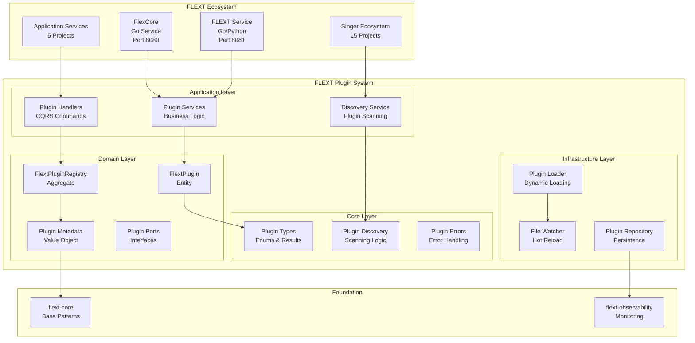

# FLEXT Plugin Architecture

This document provides a comprehensive overview of the FLEXT Plugin system architecture, focusing on Clean Architecture principles, Domain-Driven Design patterns, and integration within the broader FLEXT ecosystem.

## Architectural Vision

FLEXT Plugin implements a **plugin-first architecture** that enables dynamic loading, lifecycle management, and hot-reload capabilities across the entire FLEXT data platform. The system serves as the foundational plugin infrastructure for all FLEXT services, from Go-based runtime containers to Python-based data processing pipelines.

### Core Principles

1. **Clean Architecture**: Strict layer separation with dependencies pointing inward
2. **Domain-Driven Design**: Rich business modeling with bounded contexts
3. **CQRS**: Command Query Responsibility Segregation for scalable operations
4. **Event Sourcing**: Plugin state changes tracked as immutable events
5. **Dependency Injection**: Centralized container for loose coupling

## System Overview



## Clean Architecture Layers

### 1. Core Layer (`src/flext_plugin/core/`)

The innermost layer containing enterprise business rules and fundamental types.

**Components:**

- **Plugin Types** (`types.py`): Core enums, result objects, error classes
- **Plugin Discovery** (`discovery.py`): Pure discovery algorithms
- **Plugin Execution** (`types.py`): Execution contexts and results

**Characteristics:**

- Zero external dependencies
- Immutable business rules
- Framework-agnostic logic
- High-level policies only

```python
# Core types - no external dependencies
class PluginStatus(Enum):
    DISCOVERED = "discovered"
    LOADED = "loaded"
    ACTIVE = "active"
    INACTIVE = "inactive"

class PluginType(Enum):
    TAP = "tap"           # Singer data extraction
    TARGET = "target"     # Singer data loading
    TRANSFORM = "transform" # DBT transformations
    SERVICE = "service"   # Microservice plugins
```

### 2. Domain Layer (`src/flext_plugin/domain/`)

Contains business logic specific to plugin management domain.

**Components:**

- **Entities** (`entities.py`): Rich business objects with identity
- **Value Objects** (`entities.py`): Immutable data structures
- **Domain Ports** (`ports.py`): Abstract interfaces for external dependencies
- **Aggregates**: Consistency boundaries for plugin operations

**Key Entities:**

```python
class FlextPlugin(FlextEntity):
    """Rich plugin entity with behavior and lifecycle management."""
    name: str
    plugin_version: str
    status: PluginStatus

    def activate(self) -> bool:
        """Activate plugin with business rules validation."""

    def deactivate(self) -> bool:
        """Deactivate plugin with cleanup."""

class FlextPluginRegistry(FlextEntity):
    """Aggregate managing collection of plugins."""
    plugins: dict[str, FlextPlugin]

    def register_plugin(self, plugin: FlextPlugin) -> FlextResult:
        """Register plugin with validation and conflict resolution."""
```

### 3. Application Layer (`src/flext_plugin/application/`)

Orchestrates business logic and coordinates between layers.

**Components:**

- **Services** (`services.py`): Application business logic
- **Handlers** (`handlers.py`): CQRS command and query handlers
- **Use Cases**: Specific application scenarios

**Key Services:**

```python
class FlextPluginService:
    """Core plugin management service."""

    async def create_plugin(self, config: dict) -> FlextResult[FlextPlugin]:
        """Create new plugin with validation."""

    async def activate_plugin(self, plugin_id: str) -> FlextResult[bool]:
        """Activate plugin with lifecycle management."""

class FlextPluginDiscoveryService:
    """Plugin discovery and scanning service."""

    async def discover_plugins(self, path: str) -> FlextResult[list[FlextPlugin]]:
        """Discover plugins in specified path."""
```

### 4. Infrastructure Layer (Root Level APIs)

External interfaces and framework-specific implementations.

**Components:**

- **Platform API** (`platform.py`): Main external interface
- **Simple API** (`simple_api.py`): Factory functions and utilities
- **Hot Reload** (`hot_reload.py`): File watching and dynamic reloading
- **Plugin Loader** (`loader.py`): Dynamic module loading

## Domain-Driven Design Implementation

### Bounded Context: Plugin Management

The plugin management system operates as a distinct bounded context within the FLEXT ecosystem, with clear boundaries and interfaces for integration with other contexts.

**Core Concepts:**

- **Plugin**: Executable component with lifecycle and metadata
- **Registry**: Collection of plugins with discovery and management
- **Lifecycle**: State transitions from discovery to activation
- **Discovery**: Scanning and identification of available plugins

### Ubiquitous Language

| Term       | Definition                                  | Usage                |
| ---------- | ------------------------------------------- | -------------------- |
| Plugin     | Executable component with defined interface | Core business entity |
| Registry   | Managed collection of plugins               | Aggregate root       |
| Discovery  | Process of finding available plugins        | Core service         |
| Lifecycle  | Plugin state progression and transitions    | Business process     |
| Hot Reload | Dynamic reloading without restart           | Development feature  |
| Activation | Making plugin available for execution       | State transition     |

### Aggregates and Consistency

**FlextPluginRegistry Aggregate:**

- **Root**: FlextPluginRegistry entity
- **Entities**: FlextPlugin instances
- **Value Objects**: FlextPluginMetadata, FlextPluginConfig
- **Invariants**: No duplicate plugin names, valid status transitions

## CQRS Implementation

### Command Side (Write Operations)

**Commands:**

```python
class CreatePluginCommand:
    name: str
    version: str
    config: dict[str, object]

class ActivatePluginCommand:
    plugin_id: str

class DeactivatePluginCommand:
    plugin_id: str
```

**Command Handlers:**

```python
class FlextPluginRegistrationHandler:
    async def handle_create_plugin(self, cmd: CreatePluginCommand) -> FlextResult:
        """Handle plugin creation with validation."""

    async def handle_activate_plugin(self, cmd: ActivatePluginCommand) -> FlextResult:
        """Handle plugin activation with lifecycle management."""
```

### Query Side (Read Operations)

**Queries:**

```python
class GetPluginQuery:
    plugin_id: str

class ListPluginsQuery:
    plugin_type: Optional[PluginType]
    status: Optional[PluginStatus]
```

**Query Handlers:**

```python
class FlextPluginQueryHandler:
    async def handle_get_plugin(self, query: GetPluginQuery) -> FlextResult:
        """Retrieve plugin by ID."""

    async def handle_list_plugins(self, query: ListPluginsQuery) -> FlextResult:
        """List plugins with optional filtering."""
```

## Integration Patterns

### FLEXT Ecosystem Integration

**FlexCore (Go Service) Integration:**

```python
# Plugin proxy adapter for Go service communication
class FlexCorePluginAdapter:
    async def register_with_flexcore(self, plugin: FlextPlugin) -> FlextResult:
        """Register plugin with FlexCore runtime."""

    async def execute_plugin_via_flexcore(self, plugin_id: str, data: dict) -> FlextResult:
        """Execute plugin through FlexCore proxy."""
```

**Singer Ecosystem Integration:**

```python
# Singer-specific plugin handling
class SingerPluginAdapter:
    async def create_tap_plugin(self, config: dict) -> FlextResult[FlextPlugin]:
        """Create Singer tap plugin with metadata."""

    async def validate_singer_schema(self, plugin: FlextPlugin) -> FlextResult[bool]:
        """Validate Singer plugin schema compliance."""
```

### Dependency Injection Pattern

```python
from flext_core import FlextContainer

# Configure dependency injection
container = FlextContainer()
container.register(FlextPluginService)
container.register(FlextPluginDiscoveryService)
container.register(FlextPluginRegistrationHandler)

# Platform uses container for dependency resolution
platform = FlextPluginPlatform(container)
```

## Event Sourcing Implementation

### Plugin Events

```python
class PluginEvent:
    event_id: str
    plugin_id: str
    timestamp: datetime
    event_type: str

class PluginCreatedEvent(PluginEvent):
    plugin_name: str
    plugin_version: str
    event_type: str = "plugin_created"

class PluginActivatedEvent(PluginEvent):
    event_type: str = "plugin_activated"
```

### Event Store Integration

```python
class PluginEventStore:
    async def append_event(self, event: PluginEvent) -> FlextResult:
        """Append event to plugin event stream."""

    async def get_events(self, plugin_id: str) -> FlextResult[list[PluginEvent]]:
        """Retrieve all events for plugin."""

    async def replay_plugin_state(self, plugin_id: str) -> FlextResult[FlextPlugin]:
        """Reconstruct plugin state from events."""
```

## Quality Attributes

### Performance

- **Plugin Loading**: < 100ms for typical plugins
- **Discovery**: < 500ms for directory scanning
- **Hot Reload**: < 2s for file change detection and reload

### Scalability

- **Plugin Count**: Support for 1000+ plugins per registry
- **Concurrent Operations**: Thread-safe plugin management
- **Memory Usage**: Lazy loading and efficient caching

### Reliability

- **Error Handling**: Comprehensive error recovery and rollback
- **State Consistency**: ACID compliance for plugin operations
- **Fault Tolerance**: Graceful handling of plugin failures

### Security

- **Plugin Validation**: Schema and signature verification
- **Sandboxing**: Isolated plugin execution environments
- **Access Control**: Role-based plugin management permissions

## Next Steps

- **[Clean Architecture Deep Dive](clean-architecture.md)** - Detailed layer implementation
- **[Domain-Driven Design](domain-driven-design.md)** - Business modeling patterns
- **[Plugin Lifecycle](plugin-lifecycle.md)** - State management and transitions
- **[Integration Patterns](integration-patterns.md)** - FLEXT ecosystem integration
