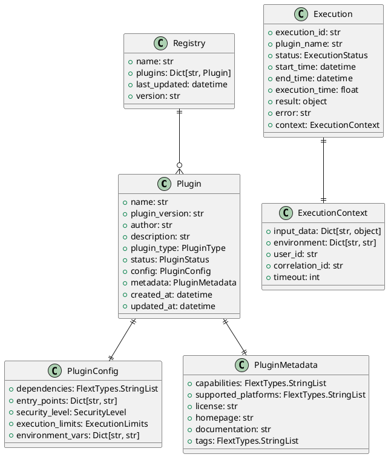
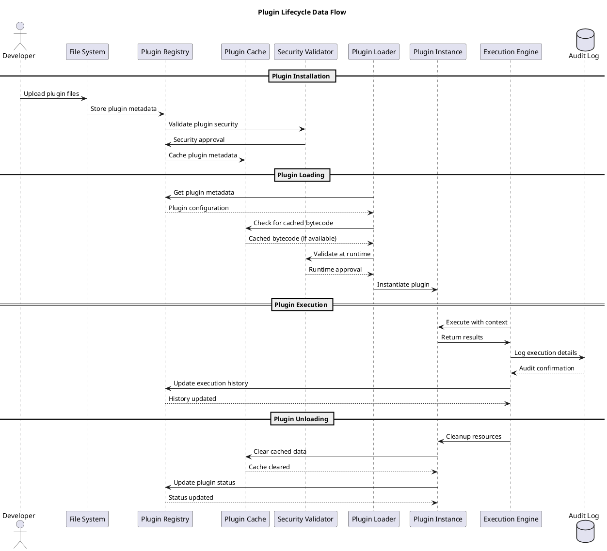
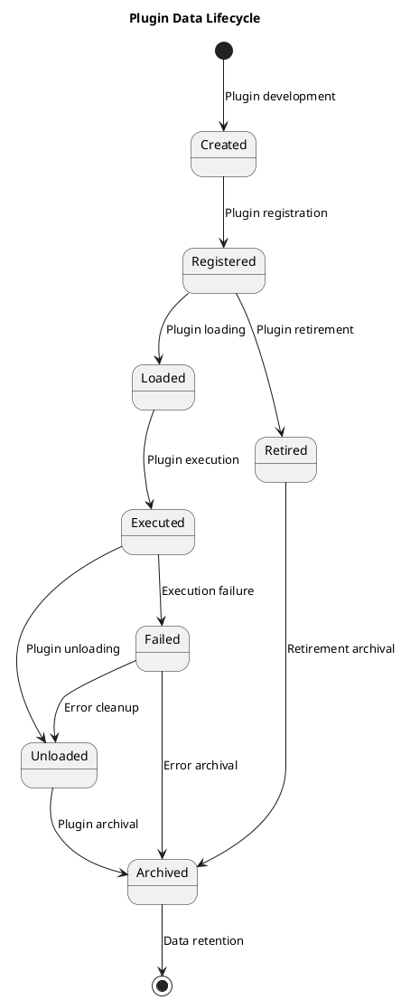

# Data Architecture

**Data Models, Storage, and Flow** | **Version**: 0.9.0 | **Last Updated**: October 2025

---

## 💾 Data Architecture Overview

FLEXT Plugin system implements a comprehensive data architecture supporting plugin metadata, configuration, execution state, and audit trails. The system uses a hybrid approach combining file-based persistence for portability with structured data models for type safety and validation.

### Data Architecture Principles

- **Type Safety First**: All data validated through Pydantic models with strict typing
- **Domain-Driven Design**: Data models reflect domain entities and business rules
- **Immutable by Default**: Data structures prefer immutability for thread safety
- **Auditable Operations**: Complete audit trails for plugin operations and state changes
- **Portable Storage**: File-based storage for deployment flexibility

---

## 🗂️ Data Model Hierarchy

### Core Data Models



---

## 📊 Data Storage Architecture

### Storage Layers

#### **Primary Storage (File System)**

- **Purpose**: Portable, deployment-flexible primary storage
- **Technology**: JSON/YAML files with atomic writes
- **Location**: `~/.flext/plugins/` (user) and `/opt/flext/plugins/` (system)
- **Data Types**:
  - Plugin metadata and configurations
  - Execution history and audit logs
  - Plugin artifacts and cache

#### **Cache Storage (Memory + File)**

- **Purpose**: Performance optimization for frequently accessed data
- **Technology**: In-memory LRU cache + file-based persistence
- **Data Types**:
  - Compiled plugin bytecode
  - Discovery results
  - Performance metrics

#### **Runtime Storage (Memory)**

- **Purpose**: Transient data during plugin execution
- **Technology**: Python dictionaries and objects
- **Data Types**:
  - Active plugin instances
  - Execution contexts
  - Temporary results

### Storage Architecture Diagram

```plantuml
@startuml Data Storage Architecture
title Data Storage Architecture

folder "File System Storage" as filesystem {
    folder "Plugin Registry" as registry {
        file "plugins.json" as plugins_file
        file "executions.json" as executions_file
    }
    folder "Plugin Cache" as cache {
        file "bytecode/" as bytecode_cache
        file "metadata/" as metadata_cache
    }
    folder "Plugin Artifacts" as artifacts {
        file "installed/" as installed_plugins
        file "temp/" as temp_files
    }
}

database "In-Memory Cache" as memory_cache {
    class "LRU Cache" as lru_cache
    class "Plugin Instances" as active_plugins
    class "Execution Contexts" as execution_contexts
}

cloud "Runtime Objects" as runtime {
    class "Plugin Objects" as plugin_objects
    class "Execution Results" as execution_results
    class "Event Data" as event_data
}

filesystem --> memory_cache: Loads into cache
memory_cache --> runtime: Provides data to runtime
runtime --> filesystem: Persists changes
runtime --> memory_cache: Updates cache
@enduml
```

---

## 🔄 Data Flow Patterns

### Plugin Lifecycle Data Flow



---

## 🔒 Data Security and Privacy

### Data Classification

#### **Public Data**

- Plugin metadata (name, version, description)
- Public configuration parameters
- Execution success/failure status
- Performance metrics (aggregated)

#### **Sensitive Data**

- Plugin execution context (may contain business data)
- Authentication credentials (encrypted at rest)
- Audit logs with user identification
- Security validation results

#### **Confidential Data**

- Plugin source code (intellectual property)
- Proprietary configuration parameters
- Security certificates and keys
- Internal system configuration

### Security Controls

#### **Data Encryption**

- **At Rest**: Sensitive data encrypted using AES-256
- **In Transit**: TLS 1.3 for all external communications
- **Key Management**: Rotatable encryption keys with secure storage

#### **Access Control**

- **Role-Based Access**: Different permission levels for data access
- **Principle of Least Privilege**: Minimal access required for operations
- **Audit Logging**: All data access logged with user context

#### **Data Validation**

- **Input Validation**: All data validated against schemas before processing
- **Type Safety**: Pydantic models ensure data structure integrity
- **Business Rules**: Domain logic validates data consistency

---

## 📈 Data Governance and Lifecycle

### Data Lifecycle Management

#### **Plugin Data Lifecycle**



#### **Data Retention Policies**

| Data Type           | Retention Period | Storage Location | Access Pattern        |
| ------------------- | ---------------- | ---------------- | --------------------- |
| Plugin Metadata     | Indefinite       | File system      | Read-heavy            |
| Execution History   | 2 years          | File system      | Write-heavy           |
| Audit Logs          | 7 years          | File system      | Append-only           |
| Performance Metrics | 1 year           | File system      | Aggregated queries    |
| Security Events     | 7 years          | File system      | Compliance queries    |
| Cache Data          | 30 days          | File system      | High-frequency access |

### Data Quality Management

#### **Data Quality Dimensions**

- **Accuracy**: Data correctly represents the real-world entities
- **Completeness**: All required data fields are present
- **Consistency**: Data is consistent across different sources
- **Timeliness**: Data is available when needed
- **Validity**: Data conforms to defined rules and constraints

#### **Quality Assurance Processes**

- **Schema Validation**: Pydantic models enforce data structure
- **Business Rule Validation**: Domain logic ensures data consistency
- **Automated Testing**: Data validation tests for all data operations
- **Monitoring**: Data quality metrics and alerts

---

## 🚀 Data Architecture Evolution

### Current Architecture (v0.9.0)

- ✅ File-based storage for portability
- ✅ Pydantic models for type safety
- ✅ In-memory caching for performance
- ✅ Basic audit logging
- ✅ JSON/YAML serialization

### Planned Enhancements (v0.10.0)

- 🔄 Database integration option (SQLite/PostgreSQL)
- 🔄 Advanced audit logging with structured events
- 🔄 Data compression for large plugin artifacts
- 🔄 Distributed caching for multi-instance deployments

### Future Architecture (v1.0.0)

- 📋 Enterprise database support with migration tools
- 📋 Advanced data analytics and reporting
- 📋 Data federation for multi-system deployments
- 📋 GDPR compliance and data portability features

---

## 🛠️ Data Architecture Tools and Technologies

### Core Technologies

#### **Data Validation**

- **Pydantic v2**: Runtime data validation and serialization
- **TypeScript-like**: Advanced typing with Python 3.13+ features
- **JSON Schema**: Standard-compliant schema definitions

#### **Data Storage**

- **JSON/YAML**: Human-readable configuration and metadata
- **Atomic Writes**: Crash-safe file operations
- **File Locking**: Concurrent access protection

#### **Data Processing**

- **Railway Pattern**: FlextResult[T] for composable data operations
- **Functional Programming**: Immutable data transformations
- **Streaming Processing**: Memory-efficient large data handling

### Development Tools

#### **Data Modeling**

```python
# Pydantic data models with validation
from pydantic import BaseModel, Field
from typing import List, Dict, object

class PluginConfig(BaseModel):
    name: str = Field(min_length=1, max_length=100)
    version: str = Field(pattern=r'^\d+\.\d+\.\d+$')
    dependencies: FlextTypes.StringList = Field(default_factory=list)
    config: Dict[str, object] = Field(default_factory=dict)

    class Config:
        frozen = True  # Immutable data model
```

#### **Data Migration**

```python
# Schema evolution and data migration
def migrate_plugin_data(old_data: dict, target_version: str) -> dict[str, object]:
    """Migrate plugin data to new schema version."""
    # Schema migration logic
    pass
```

#### **Data Validation**

```python
# Runtime data validation
def validate_plugin_config(config_data: dict) -> FlextResult[PluginConfig]:
    """Validate plugin configuration data."""
    try:
        config = PluginConfig(**config_data)
        return FlextResult.ok(config)
    except ValidationError as e:
        return FlextResult.fail(f"Configuration validation failed: {e}")
```

---

## 📊 Data Architecture Metrics

### Performance Metrics

#### **Storage Performance**

- **Read Latency**: < 5ms for metadata retrieval
- **Write Latency**: < 20ms for data persistence
- **Cache Hit Rate**: > 90% for frequently accessed data
- **Concurrent Access**: Support for 100+ concurrent operations

#### **Data Processing**

- **Validation Speed**: < 1ms per data validation
- **Serialization**: < 10ms for typical plugin configurations
- **Query Performance**: < 50ms for complex data queries
- **Memory Usage**: < 50MB for typical plugin operations

### Quality Metrics

#### **Data Quality**

- **Validation Coverage**: 100% of data operations validated
- **Schema Compliance**: 100% adherence to defined schemas
- **Error Detection**: 100% of data errors caught at validation
- **Type Safety**: 100% type coverage with runtime validation

#### **Operational Quality**

- **Data Durability**: 99.999% data persistence reliability
- **Audit Completeness**: 100% of operations fully audited
- **Recovery Time**: < 1 minute for data restoration
- **Backup Frequency**: Hourly automated backups

---

## 🔍 Data Architecture Monitoring

### Data Health Monitoring

#### **Data Integrity Checks**

- Schema validation on all data operations
- Referential integrity verification
- Data consistency across storage layers
- Corruption detection and repair

#### **Performance Monitoring**

- Query performance and latency tracking
- Storage utilization and growth monitoring
- Cache hit rates and efficiency metrics
- Data processing throughput monitoring

#### **Security Monitoring**

- Access pattern analysis and anomaly detection
- Data encryption validation
- Audit log integrity verification
- Compliance monitoring and reporting

---

## 📚 Data Architecture Documentation

### Data Dictionary

#### **Core Entities**

| Entity        | Description               | Key Fields                                | Relationships       |
| ------------- | ------------------------- | ----------------------------------------- | ------------------- |
| Plugin        | Core plugin entity        | name, version, status, config             | Has many Executions |
| Execution     | Plugin execution instance | execution_id, plugin_name, status, result | Belongs to Plugin   |
| Registry      | Plugin registry container | name, plugins, version                    | Contains Plugins    |
| Configuration | Plugin configuration      | dependencies, security, limits            | Belongs to Plugin   |

#### **Data Types**

| Type          | Purpose                 | Validation       | Examples                             |
| ------------- | ----------------------- | ---------------- | ------------------------------------ |
| PluginName    | Plugin identification   | ^[a-zA-Z0-9_-]+$ | my-plugin, data-loader               |
| PluginVersion | Semantic versioning     | ^\d+\.\d+\.\d+$  | 1.0.0, 0.9.0                         |
| ExecutionId   | Unique execution ID     | UUID format      | 123e4567-e89b-12d3-a456-426614174000 |
| SecurityLevel | Security classification | Enum values      | LOW, MEDIUM, HIGH                    |

### API Data Contracts

#### **Plugin Registration API**

```typescript
interface PluginRegistrationRequest {
  name: string;
  version: string;
  config: PluginConfig;
  metadata: PluginMetadata;
}

interface PluginRegistrationResponse {
  plugin_id: string;
  status: "registered" | "updated" | "rejected";
  validation_errors?: string[];
}
```

#### **Plugin Execution API**

```typescript
interface PluginExecutionRequest {
  plugin_name: string;
  context: Record<string, any>;
  execution_id?: string;
  timeout?: number;
}

interface PluginExecutionResponse {
  execution_id: string;
  status: "success" | "failure";
  result?: any;
  error?: string;
  execution_time: number;
}
```

---

**Data Architecture** - Comprehensive data models, storage patterns, security controls, and governance for the FLEXT Plugin system.
