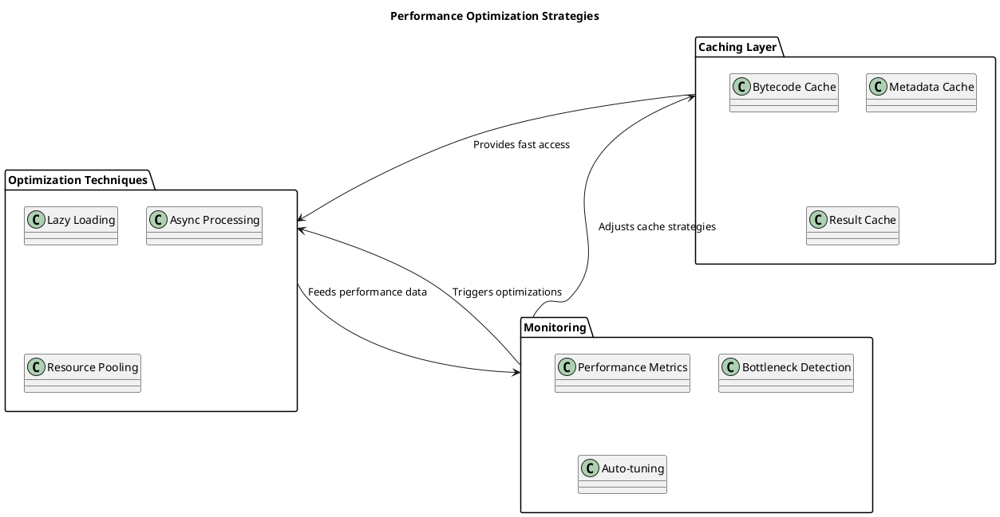
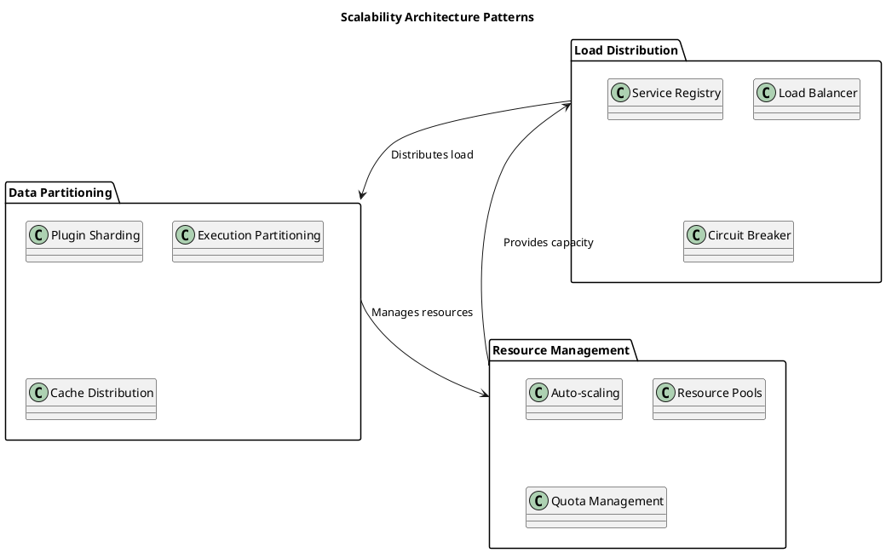
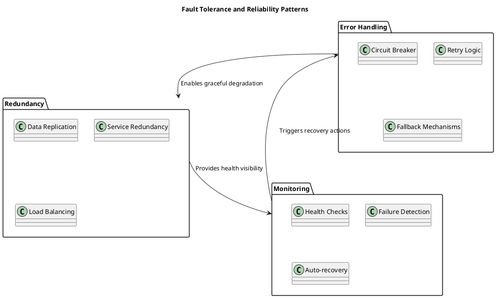
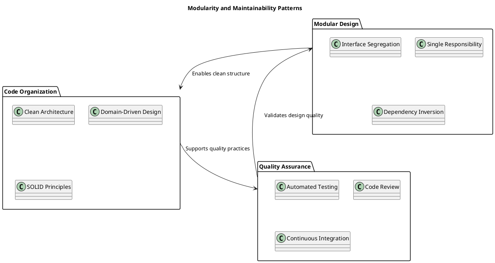
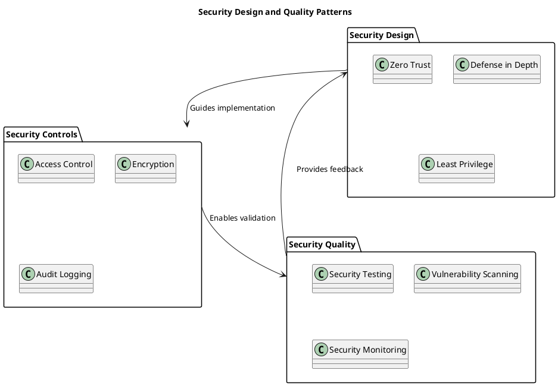
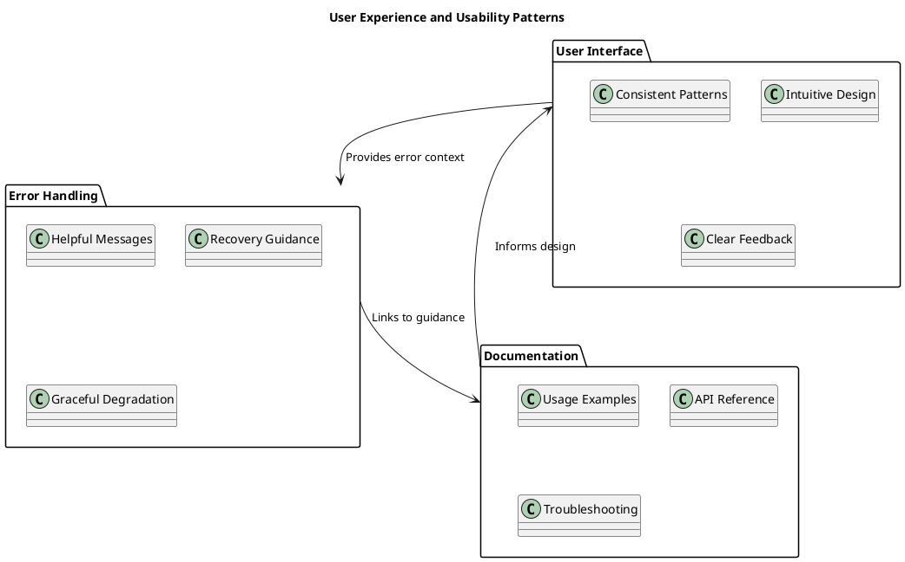
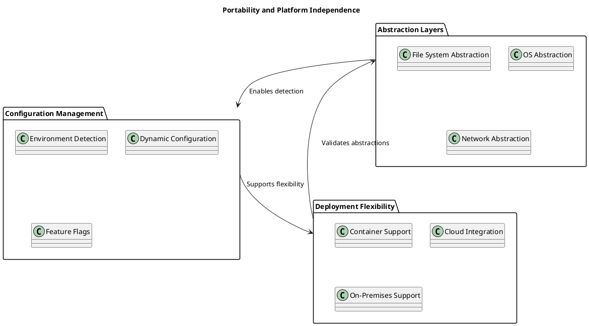
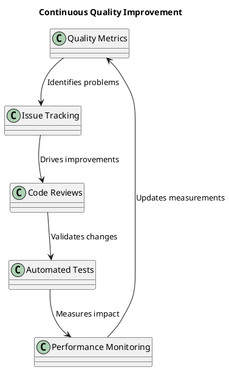

# Quality Attributes

**Performance, Scalability, Reliability, and Quality Requirements** | **Version**: 0.9.0 | **Last Updated**: October 2025

---

## 🎯 Quality Attributes Overview

FLEXT Plugin system is designed to meet enterprise-grade quality requirements across multiple dimensions. The system balances functional excellence with operational quality, ensuring reliable plugin management in production environments.

### Quality Attribute Categories

- **Performance**: Speed, efficiency, and resource utilization
- **Scalability**: Growth capacity and load handling
- **Reliability**: Dependability and fault tolerance
- **Maintainability**: Modifiability and evolvability
- **Security**: Protection against threats and vulnerabilities
- **Usability**: Ease of use and user experience
- **Portability**: Deployment flexibility and platform independence

---

## ⚡ Performance Requirements

### Performance Targets

#### **Response Time Requirements**

| Operation                  | Target Response Time | Priority | Measurement     |
| -------------------------- | -------------------- | -------- | --------------- |
| Plugin Discovery           | < 100ms              | High     | 95th percentile |
| Plugin Loading             | < 50ms               | High     | 95th percentile |
| Plugin Execution (simple)  | < 10ms               | High     | 95th percentile |
| Plugin Execution (complex) | < 500ms              | Medium   | 95th percentile |
| API Calls                  | < 20ms               | High     | 95th percentile |
| CLI Commands               | < 200ms              | Medium   | 95th percentile |

#### **Throughput Requirements**

| Scenario         | Target Throughput      | Priority | Measurement    |
| ---------------- | ---------------------- | -------- | -------------- |
| Plugin Discovery | 100 plugins/minute     | Medium   | Sustained rate |
| Plugin Execution | 1000 executions/minute | High     | Peak rate      |
| API Requests     | 1000 requests/minute   | High     | Sustained rate |
| File Operations  | 1000 files/minute      | Medium   | Sustained rate |

### Performance Architecture

#### **Performance Optimization Strategies**



#### **Performance Monitoring**

- **Real-time Metrics**: Response times, throughput, error rates
- **Resource Utilization**: CPU, memory, disk, network usage
- **Cache Hit Rates**: Effectiveness of caching strategies
- **Bottleneck Detection**: Automated identification of performance issues

---

## 📈 Scalability Requirements

### Scalability Dimensions

#### **Vertical Scalability**

- **Resource Limits**: Configurable CPU and memory allocation
- **Concurrent Operations**: Support for 100+ concurrent plugin executions
- **Data Volume**: Handle plugin registries with 1000+ plugins
- **Execution History**: Maintain execution logs for 1M+ operations

#### **Horizontal Scalability**

- **Multi-instance Support**: Distributed plugin execution across multiple nodes
- **Load Balancing**: Automatic distribution of plugin operations
- **Shared State**: Consistent plugin registry across instances
- **Failover Support**: Automatic failover for high availability

### Scalability Architecture

#### **Scalability Patterns**



#### **Scalability Metrics**

- **Concurrent Users**: Support for 1000+ concurrent users
- **Plugin Registry Size**: Handle 10,000+ registered plugins
- **Execution Throughput**: 10,000+ plugin executions per hour
- **Data Storage**: Scale to 100GB+ of plugin data and artifacts

---

## 🛡️ Reliability Requirements

### Reliability Targets

#### **Availability Requirements**

| Component        | Target Availability        | Downtime Budget | Recovery Time |
| ---------------- | -------------------------- | --------------- | ------------- |
| Plugin Platform  | 99.9% (8.77 hours/year)    | < 9 hours/year  | < 5 minutes   |
| Plugin Registry  | 99.99% (52.6 minutes/year) | < 1 hour/year   | < 1 minute    |
| Plugin Execution | 99.5% (43.8 hours/year)    | < 44 hours/year | < 10 minutes  |
| API Services     | 99.9% (8.77 hours/year)    | < 9 hours/year  | < 2 minutes   |

#### **Mean Time Between Failures (MTBF)**

- **Plugin Platform**: 720 hours (30 days)
- **Plugin Registry**: 8760 hours (365 days)
- **Plugin Execution**: 168 hours (7 days)
- **API Services**: 720 hours (30 days)

### Reliability Architecture

#### **Fault Tolerance Patterns**



#### **Failure Recovery**

- **Automatic Restart**: Failed plugins automatically restarted
- **State Recovery**: Execution state preserved across failures
- **Data Consistency**: Guaranteed consistency during failures
- **Graceful Degradation**: Core functionality maintained during partial failures

---

## 🔧 Maintainability Requirements

### Maintainability Metrics

#### **Code Quality Metrics**

- **Cyclomatic Complexity**: Average < 10 per function
- **Code Coverage**: > 90% for production code
- **Technical Debt Ratio**: < 5% of total codebase
- **Code Duplication**: < 3% of total codebase

#### **Documentation Quality**

- **API Documentation**: 100% of public APIs documented
- **Code Comments**: > 80% of complex functions commented
- **Architecture Documentation**: Up-to-date and comprehensive
- **Change Documentation**: All breaking changes documented

### Maintainability Architecture

#### **Modularity and Coupling**



#### **Evolution Support**

- **Backward Compatibility**: 95% of changes maintain compatibility
- **Migration Tools**: Automated migration for breaking changes
- **Deprecation Warnings**: Clear communication of deprecated features
- **Version Management**: Semantic versioning with change documentation

---

## 🔒 Security Quality Attributes

### Security Requirements

#### **Security Metrics**

- **Vulnerability Response Time**: < 24 hours for critical vulnerabilities
- **Security Scan Pass Rate**: 100% of security scans must pass
- **Access Control Coverage**: 100% of operations require authentication
- **Data Encryption**: 100% of sensitive data encrypted at rest and in transit

#### **Compliance Requirements**

- **GDPR Compliance**: Personal data protection and privacy
- **Security Audits**: Annual security assessments
- **Vulnerability Management**: Regular security patching
- **Incident Response**: < 1 hour mean time to respond

### Security Architecture Quality

#### **Security Design Patterns**



---

## 🎨 Usability Requirements

### User Experience Metrics

#### **API Usability**

- **Learning Time**: < 30 minutes for basic plugin operations
- **Error Messages**: 100% of errors provide clear, actionable messages
- **Documentation Coverage**: 100% of APIs have usage examples
- **Consistency**: 95% of APIs follow consistent patterns

#### **CLI Usability**

- **Command Discovery**: Intuitive command structure and help system
- **Feedback Quality**: Clear progress indicators and status messages
- **Error Recovery**: Easy recovery from common error conditions
- **Performance Feedback**: Progress indicators for long-running operations

### Usability Architecture

#### **User Experience Patterns**



---

## 🌐 Portability Requirements

### Platform Independence

#### **Deployment Flexibility**

- **Operating Systems**: Linux, macOS, Windows support
- **Container Platforms**: Docker, Podman, Kubernetes compatibility
- **Cloud Platforms**: AWS, Azure, GCP deployment support
- **On-Premises**: Bare metal and virtual machine support

#### **Runtime Compatibility**

- **Python Versions**: 3.13+ exclusive with modern features
- **Dependency Management**: Poetry-based with flexible resolution
- **File System**: POSIX-compliant with cross-platform path handling
- **Network**: HTTP/HTTPS with configurable proxy support

### Portability Architecture

#### **Abstraction Layers**



---

## 📊 Quality Attribute Trade-offs

### Quality Attribute Interactions

#### **Performance vs Security**

- **Trade-off**: Security scanning may impact performance
- **Balance**: Async scanning with caching for performance
- **Optimization**: Parallel processing with resource limits

#### **Scalability vs Complexity**

- **Trade-off**: Advanced scalability increases system complexity
- **Balance**: Progressive scaling with feature flags
- **Optimization**: Modular design for incremental adoption

#### **Reliability vs Performance**

- **Trade-off**: Redundancy and retries impact performance
- **Balance**: Configurable reliability levels
- **Optimization**: Smart caching and optimization

#### **Maintainability vs Features**

- **Trade-off**: Feature velocity vs code quality
- **Balance**: Automated quality gates and refactoring
- **Optimization**: Modular architecture for parallel development

### Quality Attribute Prioritization

#### **Primary Quality Attributes**

1. **Security**: Non-negotiable for enterprise deployments
2. **Reliability**: Critical for production operations
3. **Performance**: Essential for user experience
4. **Maintainability**: Required for long-term evolution

#### **Secondary Quality Attributes**

1. **Scalability**: Important for growth scenarios
2. **Usability**: Enhances developer productivity
3. **Portability**: Enables deployment flexibility

---

## 🧪 Quality Assurance and Validation

### Quality Gates

#### **Automated Quality Checks**

```bash
# Quality validation pipeline
make quality-check         # Overall quality assessment
make performance-test      # Performance benchmarking
make security-scan         # Security vulnerability scanning
make reliability-test      # Reliability and fault injection testing
make usability-test        # User experience validation
```

#### **Quality Metrics Dashboard**

- **Performance Trends**: Response time and throughput graphs
- **Reliability Metrics**: Uptime, MTBF, MTTR tracking
- **Security Posture**: Vulnerability counts and resolution times
- **Code Quality**: Coverage, complexity, and technical debt metrics

### Continuous Quality Improvement

#### **Quality Feedback Loop**



#### **Quality Improvement Process**

1. **Measure**: Collect quality metrics across all attributes
2. **Analyze**: Identify trends and areas for improvement
3. **Plan**: Develop improvement initiatives and roadmaps
4. **Implement**: Execute quality improvements with testing
5. **Validate**: Verify improvements meet quality targets
6. **Monitor**: Continuous monitoring and adjustment

---

## 📋 Quality Requirements Summary

### Critical Quality Requirements

| Quality Attribute   | Target                        | Measurement           | Priority |
| ------------------- | ----------------------------- | --------------------- | -------- |
| **Security**        | Zero critical vulnerabilities | Automated scanning    | Critical |
| **Reliability**     | 99.9% availability            | Uptime monitoring     | Critical |
| **Performance**     | < 100ms response time         | Performance testing   | Critical |
| **Maintainability** | < 5% technical debt           | Code analysis         | Critical |
| **Scalability**     | 1000+ concurrent operations   | Load testing          | High     |
| **Usability**       | < 30 min learning time        | User testing          | High     |
| **Portability**     | 3+ platform support           | Compatibility testing | Medium   |

### Quality Assurance Activities

#### **Daily Activities**

- Automated test execution and coverage reporting
- Code quality scanning and linting
- Security vulnerability scanning
- Performance regression testing

#### **Weekly Activities**

- Code review quality assessment
- Architecture compliance verification
- Dependency security updates
- Performance benchmark comparisons

#### **Monthly Activities**

- Comprehensive security assessments
- Architecture documentation reviews
- Quality metrics trend analysis
- Stakeholder quality feedback collection

#### **Quarterly Activities**

- External security audits and penetration testing
- Architecture fitness functions validation
- Quality attribute target reviews and updates
- Major quality improvement initiatives planning

---

**Quality Attributes** - Comprehensive performance, scalability, reliability, and quality requirements for enterprise-grade plugin management.
