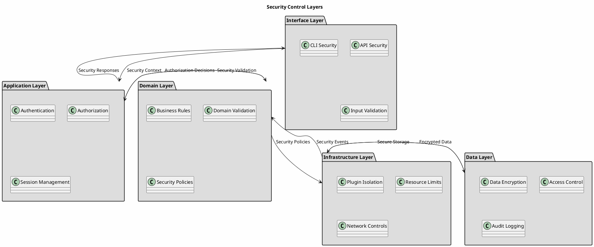
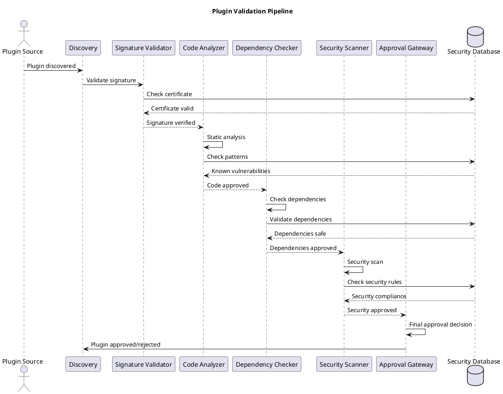
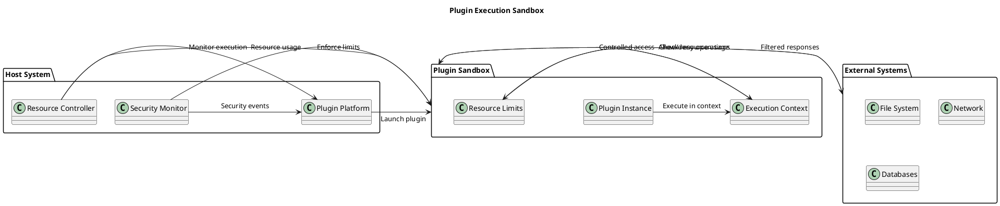
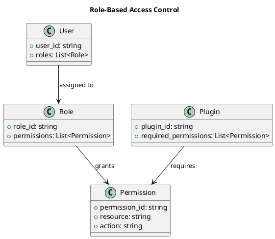
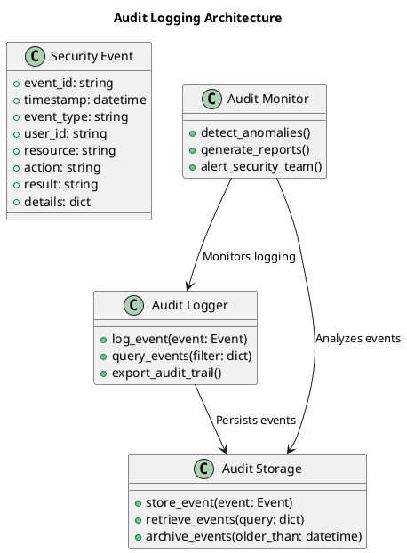
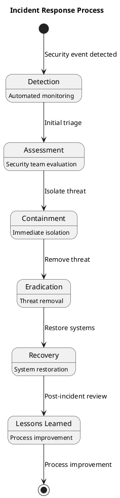

# Security Architecture

**Security Design, Controls, and Threat Model** | **Version**: 0.9.0 | **Last Updated**: October 2025

---

## 🔒 Security Architecture Overview

FLEXT Plugin system implements a comprehensive security architecture designed for enterprise environments. The system provides multiple layers of security controls, from plugin validation to execution isolation, ensuring safe plugin operations while maintaining performance and usability.

### Security Principles

- **Defense in Depth**: Multiple security layers working together
- **Least Privilege**: Minimal permissions required for operations
- **Fail-Safe Defaults**: Secure defaults with explicit permission grants
- **Audit Everything**: Complete audit trails for all security-relevant operations
- **Zero Trust**: Verify all operations, trust no external inputs

---

## 🛡️ Security Architecture Layers

### Security Control Layers



---

## 🔍 Threat Model

### STRIDE Threat Analysis

#### **Spoofing Threats**

- **Plugin Impersonation**: Malicious plugins pretending to be legitimate ones
- **Metadata Tampering**: Altered plugin metadata or configuration
- **Identity Forgery**: Fake plugin authors or sources

#### **Tampering Threats**

- **Plugin Code Modification**: Altered plugin code during distribution
- **Configuration Poisoning**: Malicious configuration injection
- **Data Manipulation**: Tampering with plugin execution results

#### **Repudiation Threats**

- **Action Denial**: Plugin operations without accountability
- **Audit Tampering**: Modification of audit logs
- **Evidence Destruction**: Removal of security evidence

#### **Information Disclosure Threats**

- **Sensitive Data Leakage**: Exposure of plugin configuration or data
- **Execution Context Exposure**: Leaking sensitive execution parameters
- **Debug Information Disclosure**: Revealing internal system details

#### **Denial of Service Threats**

- **Resource Exhaustion**: Plugins consuming excessive resources
- **Infinite Loops**: Malicious plugins causing hangs
- **Memory Leaks**: Resource leaks in plugin execution

#### **Elevation of Privilege Threats**

- **Privilege Escalation**: Plugins gaining unauthorized access
- **Capability Abuse**: Exploiting plugin permissions beyond intended use
- **Container Escape**: Breaking out of plugin isolation boundaries

---

## 🛡️ Security Controls Implementation

### Plugin Validation Pipeline



#### **Validation Stages**

1. **Signature Validation**: Cryptographic verification of plugin authenticity
2. **Code Analysis**: Static analysis for security vulnerabilities
3. **Dependency Checking**: Validation of plugin dependencies
4. **Security Scanning**: Runtime security assessment
5. **Approval Gateway**: Final approval based on security policies

### Plugin Execution Isolation

#### **Execution Sandbox**



#### **Isolation Mechanisms**

- **Process Isolation**: Each plugin runs in separate process
- **Resource Limits**: CPU, memory, disk, and network quotas
- **System Call Filtering**: Restricted system operations
- **Network Controls**: Limited network access permissions
- **File System Isolation**: Restricted file system access

---

## 🔐 Authentication and Authorization

### Authentication Mechanisms

#### **Plugin Authentication**

- **Digital Signatures**: Cryptographic verification of plugin authenticity
- **Certificate Validation**: X.509 certificate chain validation
- **Trusted Publishers**: Whitelist of approved plugin publishers
- **Code Signing**: Verification of code integrity

#### **User Authentication**

- **API Key Authentication**: For programmatic access
- **OAuth 2.0 / OpenID Connect**: For web-based access
- **LDAP Integration**: Enterprise directory authentication
- **Multi-Factor Authentication**: Enhanced security for privileged operations

### Authorization Model

#### **Role-Based Access Control (RBAC)**



#### **Permission Levels**

- **Read**: View plugin information and status
- **Execute**: Run plugins with approved permissions
- **Manage**: Install, update, and configure plugins
- **Admin**: Full system REDACTED_LDAP_BIND_PASSWORDistration privileges

---

## 📊 Security Monitoring and Audit

### Security Event Types

#### **Authentication Events**

- Successful/failed login attempts
- Password changes and resets
- Multi-factor authentication events
- Session creation and termination

#### **Authorization Events**

- Permission grants and revocations
- Role assignments and changes
- Access policy modifications
- Authorization decisions

#### **Plugin Security Events**

- Plugin validation results
- Security scan findings
- Execution anomalies
- Resource limit violations

#### **System Security Events**

- Configuration changes
- Security policy updates
- Certificate validations
- Encryption operations

### Audit Logging Architecture



#### **Audit Data Retention**

- **Security Events**: 7 years (compliance requirement)
- **Access Logs**: 2 years (operational requirement)
- **System Events**: 1 year (troubleshooting)
- **Performance Logs**: 90 days (optimization)

---

## 🔒 Data Protection and Encryption

### Data Classification and Protection

#### **Data Protection Levels**

| Classification   | Examples                    | Protection Requirements      |
| ---------------- | --------------------------- | ---------------------------- |
| **Public**       | Plugin names, descriptions  | No encryption required       |
| **Internal**     | Configuration parameters    | Access controls only         |
| **Confidential** | Business data, credentials  | Encryption at rest + transit |
| **Restricted**   | Security certificates, keys | Hardware security modules    |

#### **Encryption Implementation**

- **Data at Rest**: AES-256 encryption for sensitive data
- **Data in Transit**: TLS 1.3 for all network communications
- **Key Management**: Automated key rotation and secure storage
- **Cryptographic Agility**: Support for multiple encryption algorithms

### Secure Configuration Management

#### **Secret Management**

- **Environment Variables**: For development and testing
- **Secure Vaults**: HashiCorp Vault or AWS Secrets Manager for production
- **Key Rotation**: Automated rotation of encryption keys
- **Access Auditing**: Complete audit trail for secret access

---

## 🚨 Incident Response and Recovery

### Incident Response Process



#### **Incident Response Phases**

1. **Detection**: Automated monitoring and alerting
2. **Assessment**: Security team evaluation and impact analysis
3. **Containment**: Isolate affected systems and prevent spread
4. **Eradication**: Remove threats and vulnerabilities
5. **Recovery**: Restore systems and validate security
6. **Lessons Learned**: Review and improve processes

### Security Incident Categories

#### **Plugin-Related Incidents**

- Malicious plugin execution attempts
- Plugin privilege escalation
- Plugin data exfiltration
- Plugin denial of service

#### **System-Level Incidents**

- Unauthorized access attempts
- Configuration tampering
- Audit log manipulation
- Infrastructure compromises

#### **Data-Related Incidents**

- Sensitive data exposure
- Data integrity violations
- Encryption key compromise
- Backup data breaches

---

## 📋 Compliance and Regulatory Requirements

### Security Standards Compliance

#### **Industry Standards**

- **OWASP Top 10**: Web application security best practices
- **NIST Cybersecurity Framework**: Security control implementation
- **ISO 27001**: Information security management systems
- **CIS Controls**: Critical security controls implementation

#### **Regulatory Compliance**

- **GDPR**: Data protection and privacy regulations
- **SOX**: Financial reporting and internal controls
- **HIPAA**: Healthcare data protection (if applicable)
- **PCI DSS**: Payment card industry standards

### Compliance Implementation

#### **Security Control Mapping**

| Security Control         | Implementation               | Compliance Mapping |
| ------------------------ | ---------------------------- | ------------------ |
| Access Control           | RBAC + ABAC                  | NIST AC-2, AC-3    |
| Audit Logging            | Comprehensive event logging  | NIST AU-2, AU-3    |
| Data Encryption          | AES-256 at rest/transit      | NIST SC-13, SC-12  |
| Configuration Management | Immutable infrastructure     | NIST CM-2, CM-3    |
| Incident Response        | Automated response playbooks | NIST IR-4, IR-5    |

---

## 🔧 Security Architecture Tools and Technologies

### Security Tools Integration

#### **Static Analysis**

- **Bandit**: Python security linting
- **Safety**: Dependency vulnerability scanning
- **Semgrep**: Custom security rule engine
- **SonarQube**: Comprehensive code quality analysis

#### **Runtime Security**

- **Falco**: Container runtime security monitoring
- **Sysdig**: System call monitoring and analysis
- **OSSEC**: Host-based intrusion detection
- **ModSecurity**: Web application firewall

#### **Vulnerability Management**

- **Snyk**: Dependency vulnerability scanning
- **OWASP Dependency Check**: Automated dependency analysis
- **Trivy**: Container vulnerability scanning
- **Grype**: Software bill of materials (SBOM) analysis

### Security Automation

#### **Continuous Security**

```bash
# Security testing pipeline
make security-scan        # Automated vulnerability scanning
make dependency-audit     # Dependency security analysis
make container-scan       # Container image security
make secrets-scan         # Secret detection and validation
```

#### **Security Monitoring**

```python
# Security event monitoring
from flext_plugin import FlextPluginSecurityMonitor

monitor = FlextPluginSecurityMonitor()
monitor.watch_security_events()
monitor.alert_on_anomalies()
```

---

## 📊 Security Metrics and KPIs

### Security Effectiveness Metrics

#### **Prevention Metrics**

- **Vulnerability Detection Rate**: Percentage of vulnerabilities caught before deployment
- **False Positive Rate**: Accuracy of security scanning tools
- **Time to Detection**: Average time to detect security incidents
- **Prevention Success Rate**: Percentage of attacks successfully prevented

#### **Response Metrics**

- **Mean Time to Respond**: Average time to initial incident response
- **Mean Time to Resolve**: Average time to complete incident resolution
- **Recovery Time Objective**: Target time for system recovery
- **Data Loss Prevention**: Effectiveness of data protection controls

### Compliance Metrics

#### **Audit and Compliance**

- **Compliance Test Pass Rate**: Percentage of compliance tests passed
- **Audit Finding Resolution**: Average time to resolve audit findings
- **Policy Adherence Rate**: Percentage of systems meeting security policies
- **Certification Maintenance**: Status of security certifications

---

## 🚀 Security Architecture Evolution

### Current Security (v0.9.0)

- ✅ Plugin signature validation
- ✅ Basic resource limits
- ✅ Audit logging framework
- ✅ File-based security policies

### Enhanced Security (v0.10.0)

- 🔄 Container-based isolation
- 🔄 Advanced threat detection
- 🔄 Encrypted plugin storage
- 🔄 Security policy engine

### Enterprise Security (v1.0.0)

- 📋 Hardware security modules
- 📋 Advanced access controls
- 📋 Security information and event management (SIEM)
- 📋 Automated security response

---

## 📚 Security Architecture Documentation

### Security Documentation Index

| Document                                      | Purpose                        | Audience      | Update Frequency |
| --------------------------------------------- | ------------------------------ | ------------- | ---------------- |
| Threat Model                                  | Current threat analysis        | Security team | Quarterly        | *Documentation coming soon* |
| Security Controls                             | Control implementation details | Developers    | Monthly          | *Documentation coming soon* |
| Incident Response                             | Response procedures            | Operations    | As needed        | *Documentation coming soon* |
| Compliance Matrix                             | Regulatory compliance mapping  | Compliance    | Annually         | *Documentation coming soon* |

### Security Training and Awareness

#### **Developer Security Training**

- Secure coding practices for plugin development
- Security review processes and checklists
- Vulnerability disclosure and handling procedures
- Security testing and validation techniques

#### **Operations Security Training**

- Security monitoring and alerting procedures
- Incident response and escalation processes
- Security configuration and hardening
- Audit logging and compliance reporting

---

**Security Architecture** - Comprehensive security design, controls, threat model, and compliance framework for enterprise plugin management.
