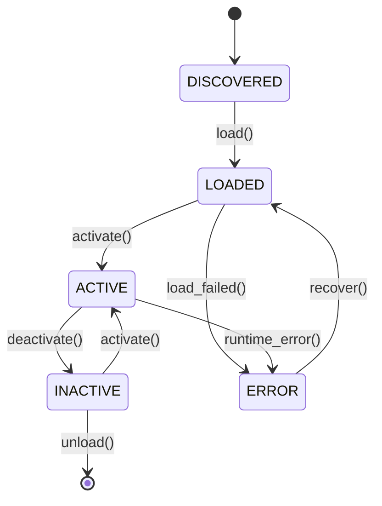

# Plugin Development Guide

This comprehensive guide walks you through creating custom plugins for the FLEXT Plugin system, from basic concepts to advanced integration patterns.

## Overview

FLEXT Plugin system enables you to create extensible, dynamic components that integrate seamlessly with the FLEXT data platform. Plugins can serve various purposes, from data extraction (Singer taps) to microservice components and custom business logic.

## Plugin Fundamentals

### Plugin Types

The system supports multiple plugin categories:

```python
from flext_plugin.core.types import PluginType

# Singer ETL plugins (Meltano integration)
PluginType.TAP         # Data extraction from sources
PluginType.TARGET      # Data loading to destinations
PluginType.TRANSFORM   # DBT-based data transformations

# Architecture plugins
PluginType.SERVICE     # Microservice components
PluginType.MIDDLEWARE  # Request/response processing
PluginType.EXTENSION   # Platform extensions

# Integration plugins
PluginType.API         # REST/GraphQL endpoints
PluginType.DATABASE    # Database connectivity
PluginType.AUTHENTICATION  # Auth providers
```

### Plugin Lifecycle

Plugins progress through well-defined states:



## Quick Start: Basic Plugin

### 1. Create Plugin Entity

```python
from flext_plugin import create_flext_plugin
from flext_plugin.core.types import PluginType, PluginStatus

# Create basic plugin
plugin = create_flext_plugin(
    name="hello-world",
    version="1.0.0",
    plugin_type=PluginType.UTILITY,
    config={
        "description": "Simple hello world plugin",
        "author": "Your Name",
        "status": PluginStatus.INACTIVE
    }
)

print(f"Created plugin: {plugin.name} v{plugin.plugin_version}")
```

### 2. Plugin Platform Integration

```python
from flext_plugin import create_flext_plugin_platform

# Create platform instance
platform = create_flext_plugin_platform(config={
    "debug": True,
    "hot_reload": True
})

# Register plugin
result = await platform.register_plugin(plugin)
if result.is_success():
    print(f"Plugin registered: {result.data}")

# Activate plugin
activation_result = await platform.activate_plugin("hello-world")
if activation_result.is_success():
    print("Plugin activated successfully")
```

### 3. Plugin Discovery

```python
from flext_plugin.application.services import FlextPluginDiscoveryService

# Create discovery service
discovery = FlextPluginDiscoveryService()

# Discover plugins in directory
plugins = await discovery.discover_plugins("./plugins")
print(f"Found {len(plugins)} plugins")

for plugin in plugins:
    print(f"- {plugin.name} ({plugin.status})")
```

## Advanced Plugin Development

### Custom Plugin Class

Create a custom plugin class for complex functionality:

```python
from flext_plugin.domain.entities import FlextPlugin
from flext_plugin.core.types import PluginStatus, PluginType
from flext_core import FlextResult
from typing import Any, Dict

class DataProcessorPlugin(FlextPlugin):
    """Custom data processing plugin."""

    def __init__(self, **kwargs):
        super().__init__(
            name="data-processor",
            version="1.0.0",
            config={
                "description": "Advanced data processing plugin",
                "author": "FLEXT Team",
                "plugin_type": PluginType.PROCESSOR
            },
            **kwargs
        )
        self._processing_config = {}

    async def initialize(self) -> FlextResult[bool]:
        """Initialize plugin resources."""
        try:
            # Setup processing resources
            self._processing_config = await self._load_config()
            return FlextResult.ok(True)
        except Exception as e:
            return FlextResult.fail(f"Initialization failed: {e}")

    async def execute(self, data: Dict[str, Any]) -> FlextResult[Dict[str, Any]]:
        """Execute plugin processing logic."""
        try:
            # Validate plugin is active
            if self.status != PluginStatus.ACTIVE:
                return FlextResult.fail("Plugin not active")

            # Process data
            processed_data = await self._process_data(data)
            return FlextResult.ok(processed_data)

        except Exception as e:
            return FlextResult.fail(f"Execution failed: {e}")

    async def cleanup(self) -> FlextResult[bool]:
        """Cleanup plugin resources."""
        try:
            # Release resources
            await self._cleanup_resources()
            return FlextResult.ok(True)
        except Exception as e:
            return FlextResult.fail(f"Cleanup failed: {e}")

    async def _load_config(self) -> Dict[str, Any]:
        """Load plugin-specific configuration."""
        return {
            "batch_size": 1000,
            "timeout": 30,
            "retry_count": 3
        }

    async def _process_data(self, data: Dict[str, Any]) -> Dict[str, Any]:
        """Core data processing logic."""
        # Implement your processing logic here
        return {
            "processed": True,
            "input_data": data,
            "timestamp": "2025-01-01T00:00:00Z"
        }

    async def _cleanup_resources(self) -> None:
        """Release allocated resources."""
        self._processing_config.clear()
```

### Plugin Configuration Management

```python
from flext_plugin.domain.entities import FlextPluginConfig
from pydantic import BaseModel, Field
from typing import Optional

class PluginSettings(BaseModel):
    """Type-safe plugin configuration."""
    batch_size: int = Field(default=100, ge=1, le=10000)
    timeout: int = Field(default=30, ge=1, le=300)
    retry_count: int = Field(default=3, ge=0, le=10)
    debug_mode: bool = Field(default=False)
    api_endpoint: Optional[str] = Field(default=None)

class ConfigurablePlugin(FlextPlugin):
    """Plugin with structured configuration."""

    def __init__(self, settings: Optional[PluginSettings] = None, **kwargs):
        self.settings = settings or PluginSettings()

        super().__init__(
            name="configurable-plugin",
            version="1.0.0",
            config={
                "description": "Plugin with structured configuration",
                "settings": self.settings.dict()
            },
            **kwargs
        )

    async def execute(self, data: Dict[str, Any]) -> FlextResult[Dict[str, Any]]:
        """Execute with configuration-aware processing."""
        try:
            # Use type-safe configuration
            for batch in self._create_batches(data, self.settings.batch_size):
                result = await self._process_batch(batch)
                if not result.is_success():
                    return result

            return FlextResult.ok({"processed": True})

        except Exception as e:
            return FlextResult.fail(f"Processing failed: {e}")
```

## Singer Plugin Development

### Creating Singer Tap Plugin

```python
from flext_plugin.core.types import PluginType
from singer_sdk import Tap
from singer_sdk.streams import RESTStream

class CustomTapPlugin(FlextPlugin):
    """Singer tap plugin for data extraction."""

    def __init__(self, **kwargs):
        super().__init__(
            name="tap-custom-api",
            version="1.0.0",
            config={
                "plugin_type": PluginType.TAP,
                "description": "Extract data from custom API",
                "singer_spec": "0.7.0"
            },
            **kwargs
        )

    async def create_tap(self) -> Tap:
        """Create Singer tap instance."""

        class CustomAPIStream(RESTStream):
            """Custom API data stream."""

            name = "users"
            path = "/api/users"
            primary_keys = ["id"]
            schema = {
                "type": "object",
                "properties": {
                    "id": {"type": "integer"},
                    "name": {"type": "string"},
                    "email": {"type": "string"},
                    "created_at": {"type": "string", "format": "date-time"}
                }
            }

        class CustomTap(Tap):
            """Custom Singer tap."""

            name = "tap-custom-api"
            config_jsonschema = {
                "type": "object",
                "properties": {
                    "api_url": {"type": "string"},
                    "api_key": {"type": "string"}
                },
                "required": ["api_url", "api_key"]
            }

            def discover_streams(self):
                """Discover available streams."""
                return [CustomAPIStream(self)]

        return CustomTap()

    async def execute_tap(self, config: Dict[str, Any]) -> FlextResult[Dict[str, Any]]:
        """Execute Singer tap with configuration."""
        try:
            tap = await self.create_tap()

            # Configure tap
            tap.config = config

            # Execute extraction
            records = []
            for stream in tap.discover_streams():
                for record in stream.get_records():
                    records.append(record)

            return FlextResult.ok({
                "records_extracted": len(records),
                "streams": [stream.name for stream in tap.discover_streams()]
            })

        except Exception as e:
            return FlextResult.fail(f"Tap execution failed: {e}")
```

### Singer Target Plugin

```python
class CustomTargetPlugin(FlextPlugin):
    """Singer target plugin for data loading."""

    def __init__(self, **kwargs):
        super().__init__(
            name="target-custom-db",
            version="1.0.0",
            config={
                "plugin_type": PluginType.TARGET,
                "description": "Load data to custom database",
                "singer_spec": "0.7.0"
            },
            **kwargs
        )

    async def create_target(self) -> Any:
        """Create Singer target instance."""
        from singer_sdk import Target
        from singer_sdk.sinks import SQLSink

        class CustomDBSink(SQLSink):
            """Custom database sink."""

            def __init__(self, target, stream_name, schema, key_properties):
                self.target = target
                super().__init__(target, stream_name, schema, key_properties)

            def process_record(self, record: Dict[str, Any], context: Dict[str, Any]):
                """Process individual record."""
                # Implement custom loading logic
                self._insert_record(record)

        class CustomTarget(Target):
            """Custom Singer target."""

            name = "target-custom-db"
            config_jsonschema = {
                "type": "object",
                "properties": {
                    "connection_string": {"type": "string"},
                    "table_prefix": {"type": "string"}
                },
                "required": ["connection_string"]
            }

            def get_sink(self, stream_name, record, schema, key_properties):
                """Get sink for stream."""
                return CustomDBSink(self, stream_name, schema, key_properties)

        return CustomTarget()
```

## Service Plugin Development

### Microservice Plugin

```python
from fastapi import FastAPI
from flext_plugin.core.types import PluginType

class APIServicePlugin(FlextPlugin):
    """Microservice plugin with FastAPI integration."""

    def __init__(self, **kwargs):
        super().__init__(
            name="api-service",
            version="1.0.0",
            config={
                "plugin_type": PluginType.SERVICE,
                "description": "REST API service plugin",
                "port": 8000
            },
            **kwargs
        )
        self.app = None

    async def initialize(self) -> FlextResult[bool]:
        """Initialize FastAPI application."""
        try:
            self.app = FastAPI(
                title=f"{self.name} API",
                version=self.plugin_version,
                description="Plugin-based API service"
            )

            # Add routes
            await self._setup_routes()
            return FlextResult.ok(True)

        except Exception as e:
            return FlextResult.fail(f"Service initialization failed: {e}")

    async def _setup_routes(self):
        """Setup API routes."""

        @self.app.get("/health")
        async def health_check():
            return {
                "status": "healthy",
                "plugin": self.name,
                "version": self.plugin_version
            }

        @self.app.get("/data")
        async def get_data():
            return await self._get_plugin_data()

        @self.app.post("/process")
        async def process_data(data: Dict[str, Any]):
            result = await self.execute(data)
            if result.is_success():
                return result.data
            else:
                raise HTTPException(status_code=500, detail=result.error)

    async def _get_plugin_data(self) -> Dict[str, Any]:
        """Get plugin-specific data."""
        return {
            "plugin_info": {
                "name": self.name,
                "version": self.plugin_version,
                "status": self.status.value
            },
            "capabilities": ["data_processing", "api_service"],
            "metrics": await self._get_metrics()
        }

    async def _get_metrics(self) -> Dict[str, Any]:
        """Get plugin metrics."""
        return {
            "requests_processed": 0,
            "uptime_seconds": 0,
            "memory_usage_mb": 0
        }
```

## Hot Reload Development

### Enable Hot Reload

```python
from flext_plugin.hot_reload import enable_hot_reload
import asyncio

async def development_workflow():
    """Development workflow with hot reload."""

    # Enable hot reload for plugin directories
    await enable_hot_reload(
        watch_paths=["./plugins", "./custom-plugins"],
        reload_on_change=True,
        preserve_state=True,
        rollback_on_error=True
    )

    # Create platform with hot reload support
    platform = create_flext_plugin_platform(config={
        "hot_reload": True,
        "watch_interval": 2,
        "debug": True
    })

    print("Hot reload enabled - modify plugin files to see live updates")

    # Keep development server running
    try:
        while True:
            await asyncio.sleep(1)
    except KeyboardInterrupt:
        print("Shutting down development server...")
        await platform.shutdown()

# Run development workflow
if __name__ == "__main__":
    asyncio.run(development_workflow())
```

### Plugin File Watcher

```python
from flext_plugin import FlextPluginPlatform
from watchdog.observers import Observer
from watchdog.events import FileSystemEventHandler
import asyncio

class PluginFileHandler(FileSystemEventHandler):
    """Handle plugin file changes for hot reload."""

    def __init__(self, platform: FlextPluginPlatform):
        self.platform = platform
        self._reload_queue = asyncio.Queue()

    def on_modified(self, event):
        """Handle file modification events."""
        if event.is_directory:
            return

        if event.src_path.endswith('.py'):
            print(f"Plugin file changed: {event.src_path}")
            asyncio.create_task(self._queue_reload(event.src_path))

    async def _queue_reload(self, file_path: str):
        """Queue plugin for reload."""
        await self._reload_queue.put(file_path)

    async def process_reloads(self):
        """Process queued plugin reloads."""
        while True:
            try:
                file_path = await asyncio.wait_for(
                    self._reload_queue.get(),
                    timeout=1.0
                )
                await self._reload_plugin(file_path)
            except asyncio.TimeoutError:
                continue

    async def _reload_plugin(self, file_path: str):
        """Reload specific plugin."""
        try:
            plugin_name = self._extract_plugin_name(file_path)
            result = await self.platform.reload_plugin(plugin_name)

            if result.is_success():
                print(f"✅ Plugin reloaded: {plugin_name}")
            else:
                print(f"❌ Reload failed: {result.error}")

        except Exception as e:
            print(f"❌ Reload error: {e}")
```

## Testing Plugin Development

### Unit Testing

```python
import pytest
from flext_plugin import create_flext_plugin
from flext_plugin.core.types import PluginType, PluginStatus

class TestCustomPlugin:
    """Test suite for custom plugin."""

    @pytest.fixture
    def plugin(self):
        """Create test plugin instance."""
        return create_flext_plugin(
            name="test-plugin",
            version="1.0.0",
            plugin_type=PluginType.UTILITY
        )

    def test_plugin_creation(self, plugin):
        """Test plugin creation."""
        assert plugin.name == "test-plugin"
        assert plugin.plugin_version == "1.0.0"
        assert plugin.status == PluginStatus.INACTIVE

    async def test_plugin_activation(self, plugin):
        """Test plugin activation."""
        result = plugin.activate()
        assert result is True
        assert plugin.status == PluginStatus.ACTIVE

    async def test_plugin_execution(self, plugin):
        """Test plugin execution."""
        # Activate plugin first
        plugin.activate()

        # Test execution
        test_data = {"input": "test"}
        result = await plugin.execute(test_data)

        assert result.is_success()
        assert "processed" in result.data
```

### Integration Testing

```python
import pytest
from flext_plugin import create_flext_plugin_platform

class TestPluginIntegration:
    """Integration tests for plugin system."""

    @pytest.fixture
    async def platform(self):
        """Create test platform."""
        platform = create_flext_plugin_platform(config={"test_mode": True})
        yield platform
        await platform.shutdown()

    async def test_plugin_registration(self, platform):
        """Test plugin registration flow."""
        plugin = create_flext_plugin(
            name="integration-test-plugin",
            version="1.0.0"
        )

        # Register plugin
        result = await platform.register_plugin(plugin)
        assert result.is_success()

        # Verify registration
        registered_plugin = await platform.get_plugin("integration-test-plugin")
        assert registered_plugin is not None
        assert registered_plugin.name == plugin.name

    async def test_plugin_lifecycle(self, platform):
        """Test complete plugin lifecycle."""
        plugin = create_flext_plugin(
            name="lifecycle-test-plugin",
            version="1.0.0"
        )

        # Register -> Activate -> Execute -> Deactivate
        await platform.register_plugin(plugin)

        activation = await platform.activate_plugin("lifecycle-test-plugin")
        assert activation.is_success()

        execution = await platform.execute_plugin(
            "lifecycle-test-plugin",
            {"test": "data"}
        )
        assert execution.is_success()

        deactivation = await platform.deactivate_plugin("lifecycle-test-plugin")
        assert deactivation.is_success()
```

## Best Practices

### Plugin Design Principles

1. **Single Responsibility**: Each plugin should have one clear purpose
2. **Loose Coupling**: Minimal dependencies on other plugins or external systems
3. **High Cohesion**: Related functionality grouped together
4. **Error Handling**: Comprehensive error handling with FlextResult pattern
5. **Resource Management**: Proper cleanup of resources in deactivation

### Performance Considerations

```python
# ✅ Good: Lazy loading of resources
class EfficientPlugin(FlextPlugin):
    def __init__(self, **kwargs):
        super().__init__(**kwargs)
        self._heavy_resource = None  # Load only when needed

    async def execute(self, data):
        if self._heavy_resource is None:
            self._heavy_resource = await self._load_heavy_resource()
        return await self._process(data)

# ❌ Bad: Loading resources in constructor
class InefficientPlugin(FlextPlugin):
    def __init__(self, **kwargs):
        super().__init__(**kwargs)
        self._heavy_resource = self._load_heavy_resource()  # Blocks initialization
```

### Security Best Practices

```python
from flext_plugin.core.types import PluginError

class SecurePlugin(FlextPlugin):
    """Plugin with security best practices."""

    async def execute(self, data: Dict[str, Any]) -> FlextResult:
        """Secure execution with validation."""
        try:
            # Input validation
            validated_data = await self._validate_input(data)
            if not validated_data.is_success():
                return validated_data

            # Permission check
            if not await self._check_permissions():
                return FlextResult.fail("Insufficient permissions")

            # Safe execution
            return await self._safe_execute(validated_data.data)

        except Exception as e:
            # Don't expose internal details
            return FlextResult.fail("Execution failed")

    async def _validate_input(self, data: Dict[str, Any]) -> FlextResult:
        """Validate and sanitize input data."""
        # Implement input validation logic
        pass

    async def _check_permissions(self) -> bool:
        """Check execution permissions."""
        # Implement permission checking
        return True

    async def _safe_execute(self, data: Dict[str, Any]) -> FlextResult:
        """Execute with safety measures."""
        # Implement safe execution logic
        pass
```

## Next Steps

- **[API Reference](../api/README.md)** - Complete API documentation
- **[Testing Guide](testing.md)** - Comprehensive testing strategies
- **[Singer Integration](singer-integration.md)** - Singer tap/target development
- **[Hot Reload Guide](hot-reload.md)** - Development workflow optimization
- **[Examples](../examples/README.md)** - Practical implementation examples
